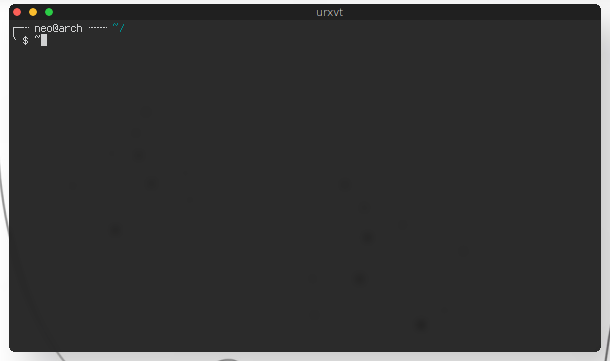

awesome macos theme
-------------------

A macOS like theme for awesome wm 4.2.

It is based on copycats copland theme.


### Requirements

- Awesome WM 4.2
- lain


### Usage

If you want to use the whole configuration, clone the repository
to `~/.config/awesome` and add lain to this path. You need to change the
paths to your shortcut scripts!


If you just want to use the them with your own config, clone the repository
to any directory and copy `themes/macos-dark` or `themes/macos-bright` to 
`~/.config/awesome/themes` and tell *beautiful* to use it. E.g.

```
beautiful.init(os.getenv("HOME") .. "/.config/awesome/themes/macos-dark/theme.lua")
```


### Screenshots




